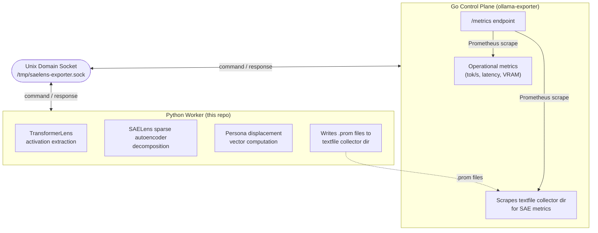

# saelens-exporter

Interpretability observability exporter for local LLM inference.

Extracts residual stream activations via TransformerLens, decomposes them
through SAELens sparse autoencoders, and emits Prometheus metrics via the
**textfile collector** pattern — Python never binds a port.

Designed to complement a Go-based Ollama operational exporter in a
two-exporter PLG stack architecture.

## Architecture



## Network Surface

**None.** Python communicates exclusively over:
- Unix domain socket (`/tmp/saelens-exporter.sock`) for commands
- Filesystem writes to the textfile collector directory

The Go exporter or `node_exporter --collector.textfile.directory` handles
all Prometheus exposition.

## Setup

```bash
# Create and activate venv
python3 -m venv .venv
source .venv/bin/activate

# Install deps (CUDA / CPU)
pip install -r requirements.txt

# Or for ROCm 6.3 (AMD GPU — e.g. RX 6700 XT on xena)
pip install -r requirements-rocm.txt

# Install the package itself (editable for development)
pip install -e .

# Pin with hashes + audit before deploying anywhere that matters
pip-compile --generate-hashes requirements.txt -o requirements.lock
pip-audit -r requirements.lock
```

## Usage

```bash
# Activate venv
source .venv/bin/activate

# Run the worker (headless, no ports)
python -m exporter.main --config config.yaml

# Or trigger a single scan via the socket
python -m exporter.client scan --prompts prompts.jsonl
```

## Integration with garak-axis

The exporter accepts prompt/response pairs from garak scans and computes
displacement metrics on the activation patterns. Feed garak output as
JSONL to the scan command — the exporter replays prompts through
TransformerLens and emits per-probe displacement scores.

## Dependencies

Pinned with hashes in `requirements.txt`. Run `pip-audit` before deploying.
